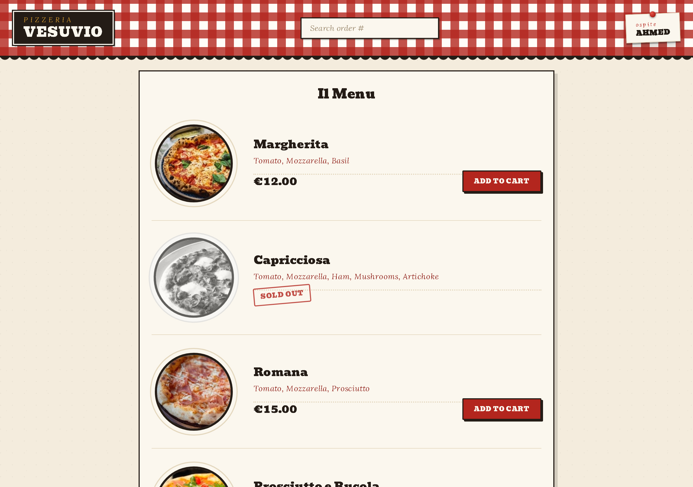
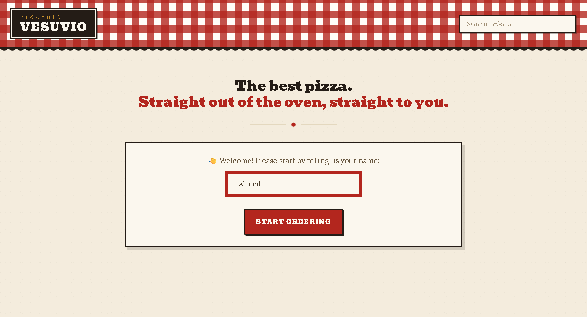
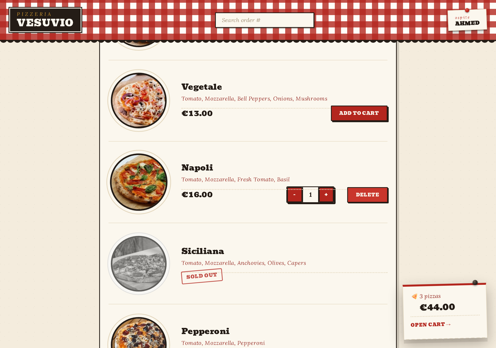
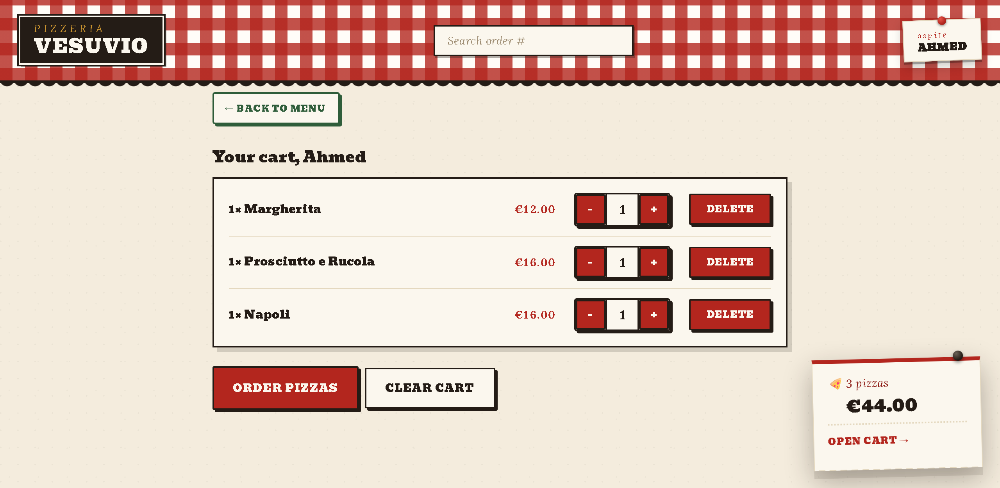
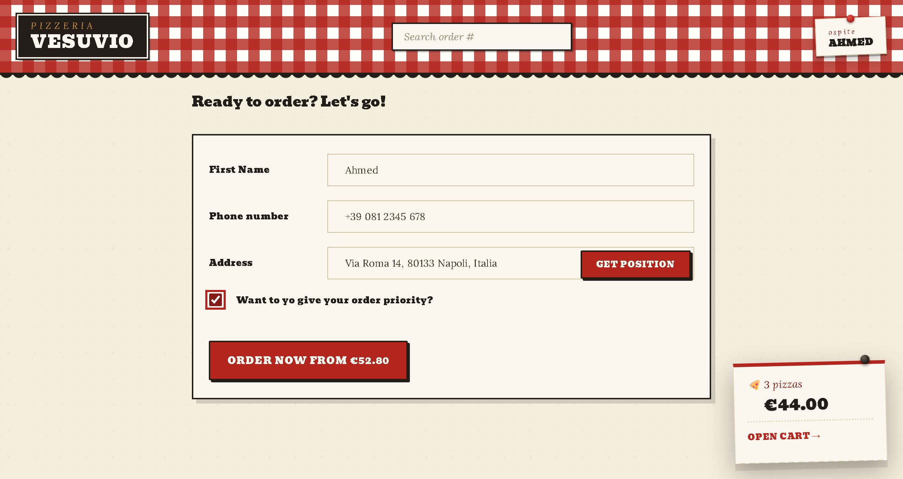
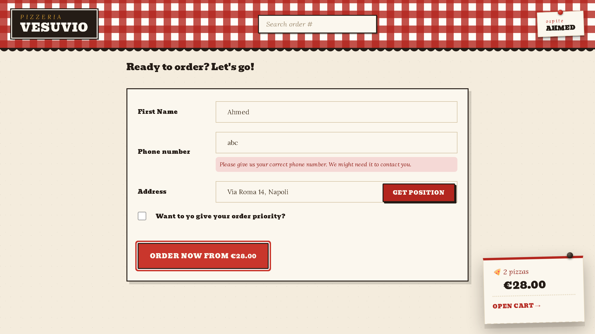
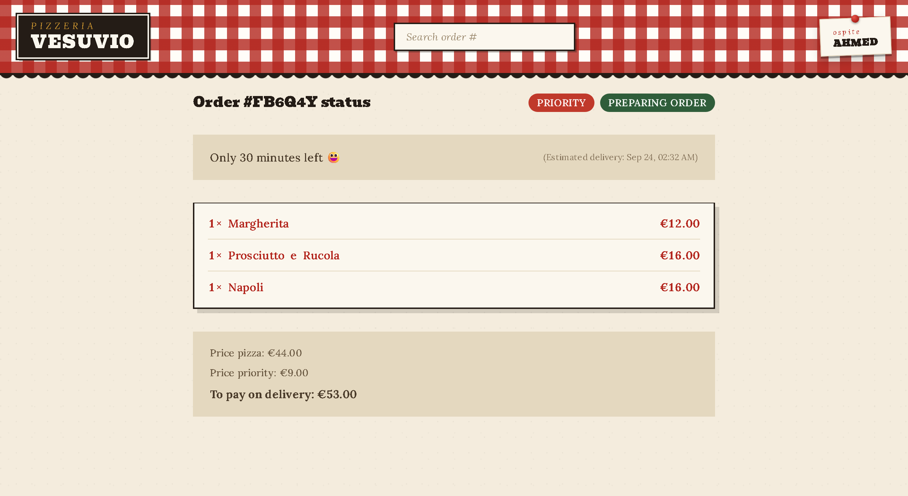
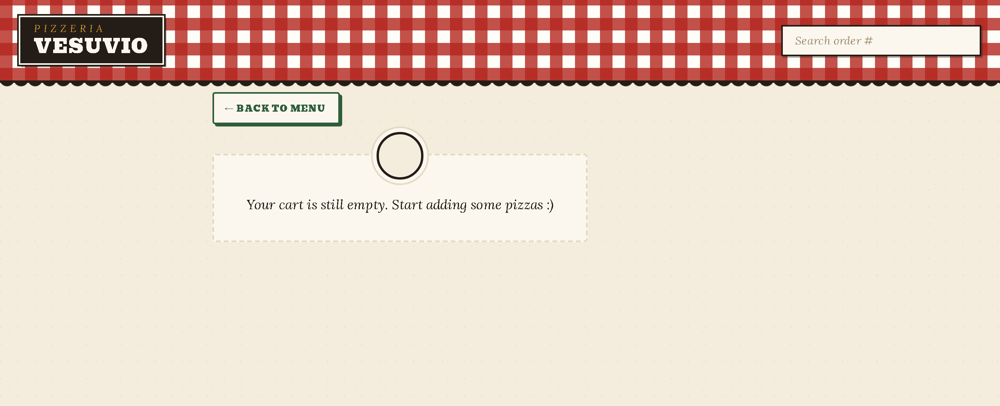
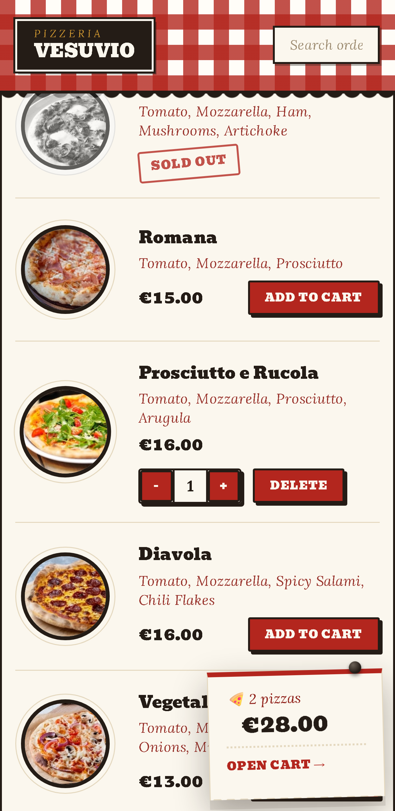
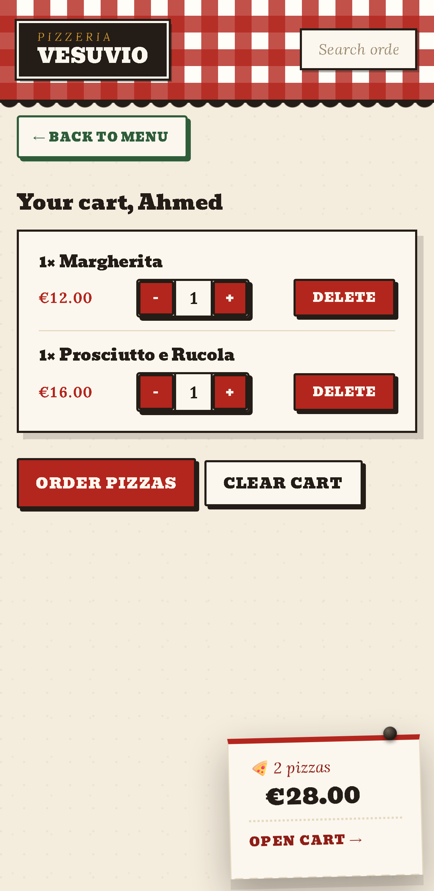

<div align="center">

# Pizzeria Vesuvio

**A complete ordering flow for a neighbourhood pizzeria — browse the menu, build a cart, place an order, track it live.**

Built with React 18, Redux Toolkit and the React Router 6 data APIs.
Hand-written CSS design system on top of Tailwind — no UI kit, no component library.

<br />



</div>

<br />

---

## What this project is

A single-page ordering app for a Neapolitan pizzeria. A guest gives their name, browses a live menu
pulled from a REST API, adds pizzas to a cart, adjusts quantities, submits an order with delivery
details, and lands on a status page that counts down to delivery. Every order is real: it is created
on the backend, gets its own ID, and can be looked up again later from the search box in the header.

I built this to get deliberate practice with the two things that separate a toy React app from a
production one: **how server state and client state are kept apart**, and **how a design holds
together when nobody hands you a component library.**

The app talks to a live REST API for the menu and the orders — no mock data, no local JSON file.

---

## The ordering flow

<table>
<tr>
<td width="50%" valign="top">

**1 · Welcome**

The guest's name is captured once and lives in Redux for the rest of the session — it reappears on the cart, on the checkout form, and on the pinned tag in the header.



</td>
<td width="50%" valign="top">

**2 · Menu**

Fetched through a React Router `loader`, so the data is already there when the route renders — no spinner-then-content flash, no `useEffect` waterfall. Sold-out pizzas are desaturated and stamped.



</td>
</tr>
<tr>
<td width="50%" valign="top">

**3 · Cart**

Quantities go up and down through Redux reducers. Dropping an item to zero removes it automatically — one reducer calls the other, so that rule lives in exactly one place.



</td>
<td width="50%" valign="top">

**4 · Checkout**

A React Router `action` handles the submit. The phone number is validated inside the action and errors come back through `useActionData`, so the form needs no local error state at all.



</td>
</tr>
<tr>
<td width="50%" valign="top">

**5 · Validation**

Invalid input never leaves the form. The action returns an errors object instead of redirecting, and the UI renders it inline next to the field.



</td>
<td width="50%" valign="top">

**6 · Order status**

Live countdown to delivery, itemised receipt, and a priority badge. An existing order can be upgraded to priority after the fact through a second route `action`.



</td>
</tr>
</table>

<details>
<summary><b>More states</b> — empty cart and mobile layout</summary>

<br />

<table>
<tr>
<td width="52%" valign="top"></td>
<td width="24%" valign="top"></td>
<td width="24%" valign="top"></td>
</tr>
</table>

</details>

---

## Why Redux is in this project

This is the question I expect to be asked about, so here is the direct answer.

**A cart is the textbook case for global client state.** It is written from the menu page, read by
the header, edited on the cart page, serialised into the checkout form, and cleared by a route
action that runs *outside* the React tree. Passing that through props would mean threading it
through five components that do not care about it. That is the problem Redux exists to solve.

**But most of the state in this app is not client state at all.** The menu and the orders belong to
the server. Putting them in Redux would mean hand-writing fetch / loading / error bookkeeping and
then keeping a stale copy of the truth in memory. So they are not in Redux — React Router's
`loader` and `action` APIs own them.

That split is the real design decision in this codebase:

| State | Where it lives | Why |
|---|---|---|
| Menu, order details | React Router `loader` | Server state. Fetched per route, never duplicated into a store. |
| Placing / updating an order | React Router `action` | A write to the server, with validation and redirect handled at route level. |
| Cart contents | Redux slice | Global client state — many readers, many writers, must survive navigation. |
| Guest name, geolocated address | Redux slice | Session-wide client state, read by three separate routes. |
| The "priority" checkbox | `useState` | Local to one form. Nothing else needs it, so nothing else sees it. |

**So why Redux Toolkit and not Context?** Context would have worked for a cart this size — and on a
product of exactly this scale I would reach for it first. I chose Redux Toolkit deliberately,
because this project is where I wanted to learn those patterns properly rather than read about them:

- **`createSlice`** — reducers that mutate a draft through Immer while staying immutable underneath
- **Selectors as a public API** — `getTotalCartPrice`, `getCurrentQuantityById(id)` keep components
  ignorant of the store's shape, so the state tree can be refactored without touching the UI
- **`createAsyncThunk`** — the "get my position" feature resolves the browser's geolocation,
  reverse-geocodes it, and drives a `loading → idle | error` status through `extraReducers`
- **Dispatching from outside React** — once an order is created, the route action clears the cart by
  importing the store directly. Knowing *why* that is a deliberate exception rather than the default
  is half the reason for learning it this way

What I want this repo to show is not that I can install Redux. It is that I can say what belongs in
a global store, what does not, and why — and that I know the cost of getting that call wrong.

---

## Tech stack

| | |
|---|---|
| **React 18** | Function components, hooks, `StrictMode` |
| **React Router 6.11** | `createBrowserRouter`, `loader`, `action`, `useNavigation`, `useActionData`, route-level `errorElement` |
| **Redux Toolkit 2** | `configureStore`, `createSlice`, `createAsyncThunk`, selectors |
| **React Redux 9** | `useSelector`, `useDispatch`, `<Provider>` |
| **Tailwind CSS 3** | Utility layer, theme remapping, responsive breakpoints |
| **Custom CSS** | ~1000 lines of hand-written CSS carrying the visual identity |
| **Vite 4** | Dev server, HMR, production build |
| **Intl API** | `Intl.NumberFormat` and `Intl.DateTimeFormat` for currency and dates — no date library |

**External services**

- Menu and orders — a public REST pizza API
- Reverse geocoding — BigDataCloud, to turn the browser's coordinates into a street address

---

## Architecture

The project is organised **by feature**, not by file type. Everything a feature needs — its
components, its Redux slice, its route loader and action — sits in one folder, so a change to "how
the cart works" is a change to one directory.

```
src/
├── features/
│   ├── cart/      Cart, CartItem, CartOverview, UpdateItemQuantity,
│   │              DeleteItem, EmptyCart, cartSlice.js
│   ├── menu/      Menu (+ loader), MenuItem
│   ├── order/     CreateOrder (+ action), Order (+ loader),
│   │              OrderItem, SearchOrder, UpdateOrder (+ action)
│   └── user/      CreateUser, Username, userSlice.js (+ async thunk)
├── services/      apiRestaurant.js, apiGeocoding.js — all network code
├── ui/            AppLayout, Header, Button, LinkButton, Loader, Error
├── utils/         helpers.js — currency, date and duration formatting
├── store.js       configureStore
└── App.jsx        the route tree
```

Two conventions I held to throughout:

- **Network code never appears inside a component.** Every `fetch` lives in `services/`, throws a
  readable error, and is called from a loader, an action or a thunk.
- **Routes own their own errors.** Each data route declares an `errorElement`, so a failed menu
  fetch degrades that one route instead of blanking the whole app.

---

## The design

The visual identity is entirely hand-written CSS — a red-gingham tablecloth header, a black enamel
wall sign, a paper menu card, pizzas plated on ceramic rings, dotted price leaders like a real
trattoria menu, a rubber-stamped SOLD OUT, and a pinned paper docket that slides in from the corner
whenever the cart is not empty.

I set myself two constraints, because they are the constraints a real handover comes with:

1. **The markup was off limits.** The entire restyle had to happen in `tailwind.config.js` and
   `index.css`. Class names in the JSX never changed — instead the Tailwind theme was remapped so
   the same `bg-yellow-400` now resolves to tomato red, and the structural work was layered on with
   descendant selectors, `::before` / `::after` and `:has()`.
2. **No images for chrome.** The gingham, the scalloped valance, the torn paper edge, the plate
   rings and the flour-dust texture are all CSS gradients and shadows — nothing extra to download,
   nothing to go blurry on a retina screen.

It is responsive down to 375px and keeps a visible focus ring on every interactive element.

---

## Running it locally

```bash
git clone https://github.com/ahmedmoh14314-code/pizzeria-vesuvio.git
cd pizzeria-vesuvio
npm install
npm run dev
```

Open `http://localhost:5173`. No environment variables or API keys required.

```bash
npm run build     # production build
npm run preview   # serve that build locally
```

---

## What I would do next

- Persist the cart to `localStorage` so a refresh does not empty it
- Optimistic UI on the priority upgrade instead of waiting for the round trip
- A test suite around the cart reducers — they hold the pricing rules and deserve one
- Responsive `srcset` sources for the menu photography

---

## Credits

Application architecture follows *The Ultimate React Course* by Jonas Schmedtmann, which I worked
through while building this. The REST API and the pizza photography are his.

The visual design, the CSS system behind it, and the write-up above are mine.

---

<div align="center">

**Ahmed** · [github.com/ahmedmoh14314-code](https://github.com/ahmedmoh14314-code)

</div>
